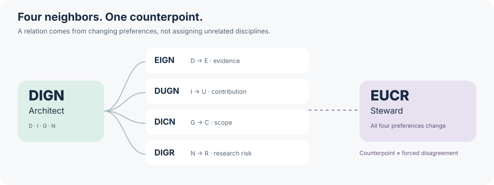

# Review16 technical guide

**One paper. Sixteen connected perspectives. Evidence behind every disagreement.**

[中文](../README.zh-CN.md) · [The four-axis system](../skills/review16/references/types.md) · [Example dashboard](../examples/report.html) · [Method](../docs/methodology.zh-CN.md) · [Evaluation plan](../docs/benchmark-plan.md)


Review16 is an agent skill for **AI/ML pre-submission paper review**. It combines a connected taxonomy of sixteen reviewer types, independent first-pass reviews, bounded evidence cross-examination, and optional blinded comparisons with historical submissions.

The goal is to explain **where a paper is strong, why reviewers disagree, and where it stands among a declared reference set**. Version 0.1 is a working skill and deterministic tooling prototype. A [real-paper workflow test](../examples/real-paper/README.md) is available; review accuracy and calibration advantages have **not been established on a held-out benchmark**.

## Four choices, sixteen related types

The types are generated, not randomly assigned to sixteen disciplines:

| Axis | First preference | Second preference |
|---|---|---|
| Evidence | **D**eductive: assumptions and derivations | **E**mpirical: observations and experiments |
| Contribution | **I**nsight: explanation and understanding | **U**tility: useful problem solving |
| Scope | **G**eneral: transferable principles | **C**ontextual: validity in a specific setting |
| Research risk | **N**ovelty-seeking: promising new directions | **R**eliability-seeking: dependable evidence |

| | General · Novel | General · Reliable | Context · Novel | Context · Reliable |
|---|---|---|---|---|
| Deductive · Insight | **DIGN** Architect | **DIGR** Guardian | **DICN** Detective | **DICR** Auditor |
| Deductive · Utility | **DUGN** Inventor | **DUGR** Engineer | **DUCN** Strategist | **DUCR** Verifier |
| Empirical · Insight | **EIGN** Explorer | **EIGR** Curator | **EICN** Hunter | **EICR** Experimenter |
| Empirical · Utility | **EUGN** Pioneer | **EUGR** Builder | **EUCN** Designer | **EUCR** Steward |

Every type has **four one-axis neighbors** and **one four-axis opposite**. DIGN and DIGR differ only in novelty versus reliability preference; DIGN and EUCR form a broad counterpoint. Eight opposite pairs drive cross-examination. Neighbor comparisons help isolate the source of a disagreement.



All sixteen reviewers share correctness standards and the target domain. A preference is not permission to invent a weakness or manufacture a different score. Fields such as optimization, language, vision, agents and ML systems map to multiple types as **routing hypotheses**. Their real-world preferences are not inferred from the illustrations. [Read the complete type model →](../skills/review16/references/types.md)

## What you get

- **Sixteen review cards:** initial and final venue scores, confidence, coverage, evidence, and explicit abstentions.
- **Disagreement you can inspect:** factual errors, different scopes and different priorities separated; original reviews preserved.
- **A preference map:** reviewer-type response separated from research-community relevance and scientific quality.
- **Historical positioning when data permit:** target mixed into anonymous full-text packets, stratified reference sampling, order-reversed pair comparisons, and a conservative sample-anchor rank interval.
- **An audit trail:** prompts, JSON outputs, comparison plans, provenance and a self-contained HTML report.

No forced 6/10, forced spread or arithmetic consensus. The skill reads the actual venue rubric: for example, **NeurIPS 2025 uses 1–6, with 6 meaning Strong Accept**, illustrating why a fixed universal scale is wrong. [Official reviewer guidelines](https://neurips.cc/Conferences/2025/ReviewerGuidelines)

## Install locally

From the root of this downloaded or cloned repository:

```bash
# Codex
mkdir -p ~/.codex/skills
cp -R skills/review16 ~/.codex/skills/review16

# Or Claude Code, per project
mkdir -p .claude/skills
cp -R skills/review16 .claude/skills/review16
```

Do not overwrite an existing customized installation. The skill is ordinary Markdown, JSON and Python 3.9+ standard-library code. It includes no paid API runner. Subagent dispatch uses the host's available tools; sixteen independent tasks can run in batches. Codex task preparation and local scripts are tested; other hosts require their own integration smoke test.

Ask your agent:

> Use Review16 to review this manuscript for my target conference and track. Run all sixteen types with a shared domain and rubric, preserve their initial reviews, then conduct one evidence-based cross-examination round. Report each type's score and explain preference differences. If suitable public historical scores and matching paper versions are available, add blind anchor positioning. Otherwise label the scores uncalibrated.

Codex users can invoke `$review16`. Provide the manuscript, supplements, target venue/year/track and a practical review budget. You do not need to launch sixteen agents manually.

## Try the tooling

Open [examples/report.html](../examples/report.html) locally for a **synthetic interface demonstration**. It does not contain real review outcomes or measured product performance.

```bash
# Prepare independent task prompts using your verified venue rubric.
python3 skills/review16/scripts/panel.py prepare \
  --manuscript /absolute/path/paper.pdf \
  --venue-config /absolute/path/venue.json --out /tmp/my-review16

# After the host's subagents write their review JSON files:
python3 skills/review16/scripts/panel.py report \
  --run /tmp/my-review16 --reviews /tmp/my-review16/reviews \
  --out /tmp/my-review16-report.html

# Offline blind-packet demonstration; these fixtures are synthetic.
python3 skills/review16/scripts/anchor_rank.py prepare \
  --corpus examples/anchors/corpus.synthetic.json --target examples/anchors/target.synthetic.json \
  --out /tmp/review16-anchors --per-band 2 --seed 42
python3 skills/review16/scripts/anchor_rank.py plan-pairs \
  --public /tmp/review16-anchors/public/manifest.json \
  --out /tmp/review16-anchors/public/plan.json

python3 -m unittest discover -s tests -v
```

See the [review JSON contract](../skills/review16/references/output-contract.md), [anchor format and commands](../skills/review16/references/anchor-format.md), and [blinding protocol](../skills/review16/references/anchors.md). A source-checked [NeurIPS 2025 main-track scale](../skills/review16/references/venues/neurips-2025-main.json) is included as a historical adapter; it must not silently stand in for another year or venue. Output paths must be new; existing runs are not silently overwritten.

## Why the historical comparison is careful

Ten papers per score band create a **balanced reference set**, not a representative sample of all conference submissions. Its rank is not a conference percentile or an acceptance probability. Version 0.1 always leaves `acceptance_probability` null. Sparse comparisons may produce a wide interval, which is shown rather than concealed.

Historical ratings must correspond to the paper version and review phase actually assessed. Not every venue publishes rejected-paper reviews. Current OpenReview PDFs can be later revisions. The included public single-forum collector preserves raw metadata and unknowns; it does not automatically solve version alignment. Live requests returned HTTP 403 in this environment. The included PeerRead fallback successfully retrieved a genuine ICLR 2017 manuscript and original recommendations; version/phase alignment remains unverified. [OpenReview retrieval documentation](https://docs.openreview.net/how-to-guides/data-retrieval-and-modification/how-to-get-all-notes-for-submissions-reviews-rebuttals-etc)

The target-review panel and blind comparators use separate contexts. File separation alone is not an access-control sandbox. Repeated appearances of the target can reveal its identity, so comparison plans treat every anonymous manuscript symmetrically. Recognition and order instability remain explicit limitations.

## Evaluation before claims

The [benchmark plan](../docs/benchmark-plan.md) compares a single reviewer, equal-budget homogeneous reviewers, the sixteen types, evidence cross-examination, and historical anchors. It measures factual review errors, consequential-defect detection, human ranking agreement, order stability, valid-repair sensitivity and cost. It also tests whether changing one axis changes the intended review preference.

Current engineering checks verify the type graph, input contracts, blindness-related metadata separation, rank bounds, parser behavior and report rendering. **Engineering tests do not establish review accuracy.** A sixteen-agent real-paper execution test is published, but no comparative accuracy benchmark has been completed. [Validation record and real-paper test →](../docs/validation.md)

## Related work and contribution

Review16 builds on an existing ecosystem, including [PaperJury](https://github.com/Spark-To-Paper-Skills/paperjury), [AgentReview](https://github.com/Ahren09/AgentReview), [Scientific Agent Skills](https://github.com/K-Dense-AI/scientific-agent-skills), and pairwise review research such as [ComparisonReview](https://aclanthology.org/2026.findings-acl.1195/). Personalities, multiple agents, debate and pairwise ranking are not claimed as inventions. [Dated ecosystem research →](../docs/landscape.zh-CN.md)

Contributions with the highest value: reproducible failure cases, version-verified public anchor manifests, official rubric adapters, and blinded evaluation results. Please do not contribute confidential submissions or personal reviewer data. See [CONTRIBUTING.md](../CONTRIBUTING.md).

Original illustrations were generated with the built-in image tool; [prompts and provenance](../assets/illustration-provenance.md) are included. This project is not affiliated with MBTI or 16Personalities, and its type system is not a validated personality assessment.

MIT licensed for project code and original materials. Third-party papers and reviews retain their original terms. See [LICENSE](../LICENSE).

## Public archive fallback

When OpenReview is unavailable, download one historical ICLR 2017 paper from the pinned AllenAI PeerRead archive:

```bash
python3 skills/review16/scripts/fetch_peerread.py \
  --paper-id 673 --split dev --download-pdf --out /tmp/review16-peerread
```

The output contains a paper PDF and private source-audit metadata. Never pass human review metadata to the first-pass reviewers. This verifies retrieval, not version/phase alignment; the source remains ineligible for calibrated anchor ranking until that separate audit succeeds. See [the executed case study](../examples/real-paper/README.md).

A source-checked [ICLR 2017 rubric adapter](../skills/review16/references/venues/iclr-2017-conference.json) is included for historical assessments. Assess historical novelty in its period and disclose recognition risk.
